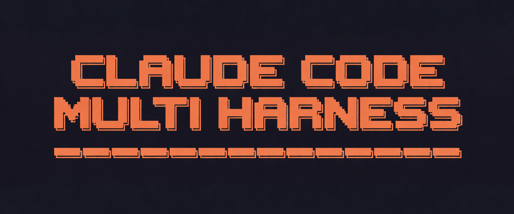

<p align="center">
  
</p>

[](README_pt.md)

# Claude Multi-Team Harness

A multi-team/multi-agent runtime focused on **Claude Code TUI + Claude Code Router (CCR)**.

Operational model:
- `orchestrator`
- `team leads`
- `workers`

## What This Branch Delivers

- Single launcher for Claude TUI with crews: `run:crew`
- Automatic custom-agent generation from `.claude/crew/<crew>/multi-team.yaml`
- Policy-based routing through CCR
- Strict hierarchy by default (`orchestrator -> leads`)
- Hierarchy opt-out with `--no-hierarchy`
- MCP configuration compatible with Claude's expected format (`mcpServers`)

## Structure

- [`.claude/crew/`](./.claude/crew): crew definitions
- [`.claude/scripts/`](./.claude/scripts): launcher and utilities
- [`.claude/package.json`](./.claude/package.json): runtime commands
- [`.claude/ccr/`](./.claude/ccr): custom router and route map
- [`.mcp.json`](./.mcp.json): Claude-format MCP config

## Prerequisites

- Node.js
- `claude` CLI available in PATH
- `ccr` available in PATH

## Installation

```bash
npm --prefix .claude install
```

## Short CLI (`ccmh`)

Install the shortcut CLI once:

```bash
npm --prefix .claude run ccmh:install
```

Use `ccmh` commands:

```bash
ccmh list:crews
ccmh use marketing
ccmh use --marketing
ccmh --use marketing
ccmh run --crew marketing
```

## Main Commands

List crews:

```bash
ccmh list:crews
```

Select active crew:

```bash
ccmh use <crew>
```

Clear active crew:

```bash
ccmh clear
```

Open Claude TUI with multi-team (primary alias):

```bash
ccmh run --crew marketing
```

Resume session (`-c`):

```bash
ccmh run --crew marketing -- -c
```

Mirror session metadata into the crew directory (optional):

```bash
ccmh run --crew marketing --session-mirror
```

## Hierarchy UX

Strict hierarchy (default):
- The root session agent catalog exposes only `leads`.
- The orchestrator receives explicit rules to avoid direct delegation to workers.

Relax hierarchy:

```bash
ccmh run --crew marketing --no-hierarchy
```

Force strict hierarchy explicitly:

```bash
ccmh run --crew marketing --hierarchy
```

## CCR Routing

Install custom router + route map:

```bash
ccmh ccr:install-router
ccmh ccr:sync-route-map
```

Run with a policy:

```bash
ccmh run --crew marketing --policy economy
```

Force routing for the root/orchestrator:

```bash
ccmh run --crew marketing \
  --root-route --root-model lmstudio,nvidia/nemotron-3-nano-4b
```

## MCP (Claude Format)

Valid file for Claude:
- [`.mcp.json`](./.mcp.json)

Format:

```json
{
  "mcpServers": {
    "server-name": {
      "transport": "stdio",
      "command": "...",
      "args": []
    }
  }
}
```

## Quick Troubleshooting

Show launcher help:

```bash
ccmh run --help
```

If CCR does not apply route changes:

```bash
ccr restart
```

If you only want to validate the command without opening TUI:

```bash
ccmh run --crew marketing --dry-run -- --version
```

## Support & Sponsoring

<p align="center">
  
</p>

If this project helps you, consider supporting it:

- Buy Me a Coffee: https://buymeacoffee.com/alyssonm
